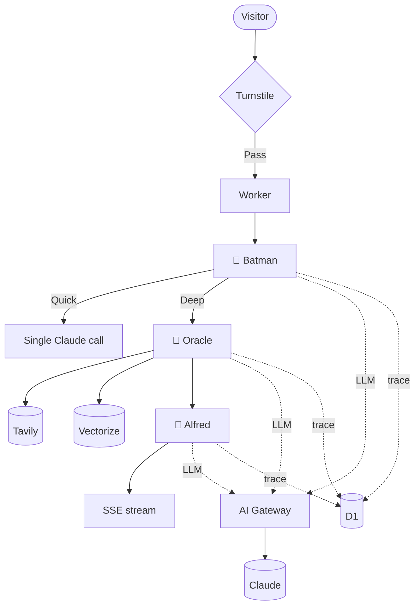

# AXOD Research Agent

> Multi-agent research pipeline running on Cloudflare Workers. Three agents — **Batman**, **Oracle**, **Alfred** — collaborate to deliver structured intelligence reports on any topic.

**Live demo:** [axodcreative.pages.dev/research](https://axodcreative.pages.dev/research) *(coming in Phase 5)*

**Companion site:** [axodcreative.pages.dev](https://axodcreative.pages.dev)

---

## The Agents

| Role | Character | Function |
|---|---|---|
| 🦇 Orchestrator | **Batman** | Classifies query, routes work, calls the shots |
| 📡 Research | **Oracle** | Web search via Tavily, fetches sources, embeds findings into memory |
| 🎩 Synthesis | **Alfred** | Reads Oracle's findings, structures the report |

Each agent has a documented voice (see `src/agents/*.ts`). Every action is traced to D1 and surfaced to visitors via the **"Show Reasoning"** toggle on the live demo.

---

## Architecture



---

## Stack

| Layer | Tech |
|---|---|
| Runtime | Cloudflare Workers |
| Language | TypeScript |
| LLM proxy | Cloudflare AI Gateway |
| LLM | Anthropic Claude (Sonnet 4.6) |
| Web search | Tavily |
| Vector memory | Cloudflare Vectorize |
| Trace store | Cloudflare D1 |
| Bot protection | Cloudflare Turnstile |
| Streaming | Server-Sent Events |

---

## Endpoints

| Method | Path | Purpose |
|---|---|---|
| `GET` | `/` | Service health + agent list |
| `GET` | `/hello` | Batman greeting + writes a trace event to D1 |
| `POST` | `/research` | Submit a query (mode: `quick`), runs Tavily + LLM, returns structured answer with sources |
| `GET` | `/trace/:id` | Retrieve a query + its full agent timeline |

### Example: POST /research

```bash
curl -X POST http://127.0.0.1:8787/research \
  -H "Content-Type: application/json" \
  -d '{"query":"What is Cloudflare Workers AI?","mode":"quick"}'
```

Response:
```json
{
  "queryId": "ad233b68-3358-40a0-9289-b2d77c11eff9",
  "mode": "quick",
  "report": "Cloudflare Workers AI is a serverless edge inference platform...",
  "sources": [
    { "n": 1, "title": "Cloudflare Workers AI | Promptfoo", "url": "..." }
  ],
  "stats": {
    "totalDurationMs": 3849,
    "tokensIn": 1062,
    "tokensOut": 122,
    "costUsd": 0,
    "sourcesFound": 5
  }
}
```

---

## Local Development

**Requirements:** Node 22+, pnpm, [Cloudflare account](https://dash.cloudflare.com) with Wrangler authenticated (`npx wrangler login`).

```bash
# Install
pnpm install

# Create the D1 database (one-time)
npx wrangler d1 create axod-research-traces
# Then paste the returned database_id into wrangler.toml

# Run schema migration (local SQLite mirror)
pnpm db:init

# Start dev server → http://127.0.0.1:8787
pnpm dev
```

Test the endpoints:

```bash
curl http://127.0.0.1:8787/
curl http://127.0.0.1:8787/hello
curl http://127.0.0.1:8787/trace/<query-id-from-hello>
```

---

## Deploy

```bash
# Push schema to remote D1
pnpm db:init:remote

# Set required secrets
npx wrangler secret put ANTHROPIC_API_KEY
npx wrangler secret put TAVILY_API_KEY      # Phase 2
npx wrangler secret put TURNSTILE_SECRET    # Phase 4

# Ship it
pnpm deploy
```

---

## Roadmap

| Phase | Status |
|---|---|
| **1** — Repo scaffold + D1 + AI Gateway + `/hello` | ✅ v0.1.0 |
| **2** — Quick mode: single-agent flow with web search | ✅ v0.2.0 |
| **3** — Deep mode: Batman → Oracle → Alfred multi-agent flow | ⏳ |
| **4** — Turnstile bot protection + per-IP rate limit | ⏳ |
| **5** — Frontend `/research` page on the AXOD site | ⏳ |
| **6** — "Show Reasoning" toggle | ⏳ |
| **7** — End-to-end deploy with CORS + secrets | ⏳ |
| **8** — Polish, error states, mobile responsive | ⏳ |
| **9** — Replace placeholder Projects card with real links | ⏳ |

Full design: see [research-agent-plan.md](https://github.com/adrew0321/AXODCREATIVE/blob/main/research-agent-plan.md) in the AXODCREATIVE repo.

---

## Branching

| Branch | Purpose |
|---|---|
| `main` | Production. Never commit directly. |
| `dev` | Integration. PRs land here first. |
| `feature/xyz` | One branch per feature. |

---

## License

MIT
